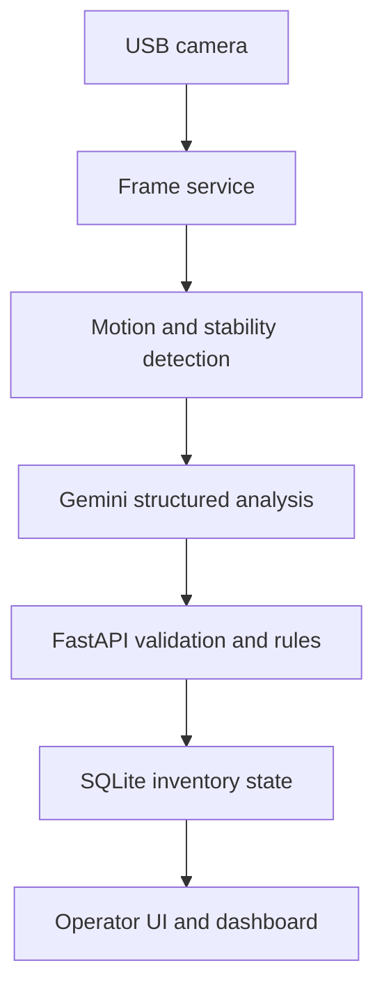

# Edge AI Inventory Monitor

A local-first prototype for monitoring labeled inventory bins with a USB camera, motion detection, and structured Gemini vision output.

The system is designed for spare-parts rooms, maintenance cribs, and small manufacturing inventory areas where a full machine-vision installation may be impractical. It captures a shelf image after activity settles, estimates visible quantity, compares the observed product with the configured product, and updates a lightweight web dashboard.

> **Project status:** working engineering prototype and portfolio project. Vision results are decision support and should be validated by a person before they drive purchasing, maintenance, or production decisions. This application is not PLC logic or a safety system.

## What it demonstrates

- Edge camera integration with OpenCV
- Motion-triggered scanning with stability, cooldown, and concurrency controls
- Structured vision-language-model prompting and JSON response validation
- Local FastAPI service and browser-based operator interface
- SQLite persistence with WAL mode and parameterized queries
- Quantity-change tracking and product-mismatch warnings
- Separation between probabilistic AI decisions and deterministic application logic

## System workflow



The application supports two vision workflows:

1. **Setup analysis** reads visible bin labels and creates the initial bin records.
2. **Inventory scan** sends only known bin codes to Gemini, validates the returned list, updates quantities, and flags possible product mismatches.

Auto Scan watches the camera feed for motion. It waits for the scene to become stable, applies a post-motion delay, and uses per-shelf locks and cooldowns to avoid duplicate scans.

## Technology

| Layer | Technology |
| --- | --- |
| Edge capture | USB camera, OpenCV |
| Change detection | OpenCV, NumPy |
| AI analysis | Google Gemini via `google-genai` |
| API | FastAPI, Uvicorn |
| Data | SQLite |
| Interface | HTML, CSS, JavaScript |
| Target hardware | Raspberry Pi 5 or Linux computer |

## Run locally

Requirements:

- Python 3.11+
- USB camera or compatible camera device
- Gemini API key

```bash
git clone https://github.com/celikender/ai_inventory.git
cd ai_inventory

python3 -m venv .venv
source .venv/bin/activate
pip install -r requirements.txt

cp .env.example .env
# Add your GEMINI_API_KEY to .env

./run.sh
```

Open:

- Operator interface: <http://localhost:8000/ui>
- Inventory dashboard: <http://localhost:8000/ui/dash>
- Interactive API documentation: <http://localhost:8000/docs>
- Health check: <http://localhost:8000/health>

For API-only development without a camera, set `CAMERA_ENABLED=false` in `.env`. Camera-dependent endpoints will still require a valid frame.

## Typical demo

1. Place visible bin-code labels such as `A-01` and `A-02` on the shelf.
2. Create a project and shelf in the operator interface.
3. Set the expected bin count and run **Setup Analyze**.
4. Review or correct the detected product names and descriptions.
5. Add or remove parts and run **Scan**, or enable **Auto Scan**.
6. Review quantity changes and product-mismatch warnings in the dashboard.

To analyze a saved image without starting the web application:

```bash
python -m scripts.analyze_image path/to/shelf.jpg
```

## Test

The repository includes deterministic tests for model-response parsing:

```bash
python -m unittest discover -s tests
```

Camera and Gemini calls are integration behaviors and require hardware and credentials, so they are not executed by the unit-test suite.

## Main API routes

| Method | Route | Purpose |
| --- | --- | --- |
| `GET` | `/health` | Application and camera-service status |
| `GET/POST` | `/projects` | List or create inventory projects |
| `GET/POST` | `/projects/{project_id}/shelves` | List or create shelves |
| `POST` | `/projects/{project_id}/shelves/{shelf_id}/setup_analyze` | Detect and initialize labeled bins |
| `POST` | `/projects/{project_id}/shelves/{shelf_id}/scan` | Capture and analyze current inventory |
| `POST` | `/projects/{project_id}/shelves/{shelf_id}/autoscan` | Enable or configure motion-triggered scanning |
| `GET` | `/projects/{project_id}/dash` | Return dashboard inventory state |

## Repository structure

```text
ai/          Gemini client, prompts, configuration, and response parsing
app/         FastAPI application, routes, and browser UI
capture/     Persistent and one-shot camera capture
core/        Motion/change detection
scripts/     Manual image-analysis utility
storage/     SQLite data-access layer and runtime data location
tests/       Deterministic unit tests
```

## Engineering boundaries

This repository intentionally keeps the prototype local and understandable. It does not currently include authentication, multi-device coordination, production observability, a PLC/SCADA connector, or a measured vision-accuracy study. Autoscan configuration is stored in process memory and resets when the service restarts.

Before production use, the next engineering steps would be:

- Create a labeled validation set and publish quantity/mismatch accuracy results
- Add human confirmation and an audit trail for AI-proposed inventory changes
- Add authentication and authorization
- Persist autoscan configuration and operational events
- Package the service with Docker or `systemd` for Raspberry Pi deployment
- Add MQTT, OPC UA, or REST integration for MES/CMMS consumption

## Author

Built by **Ender Celik** as part of an industrial automation, SCADA/MES, and IIoT engineering portfolio. See [vMaint](https://vmaint.com) for the broader industrial operations platform.
